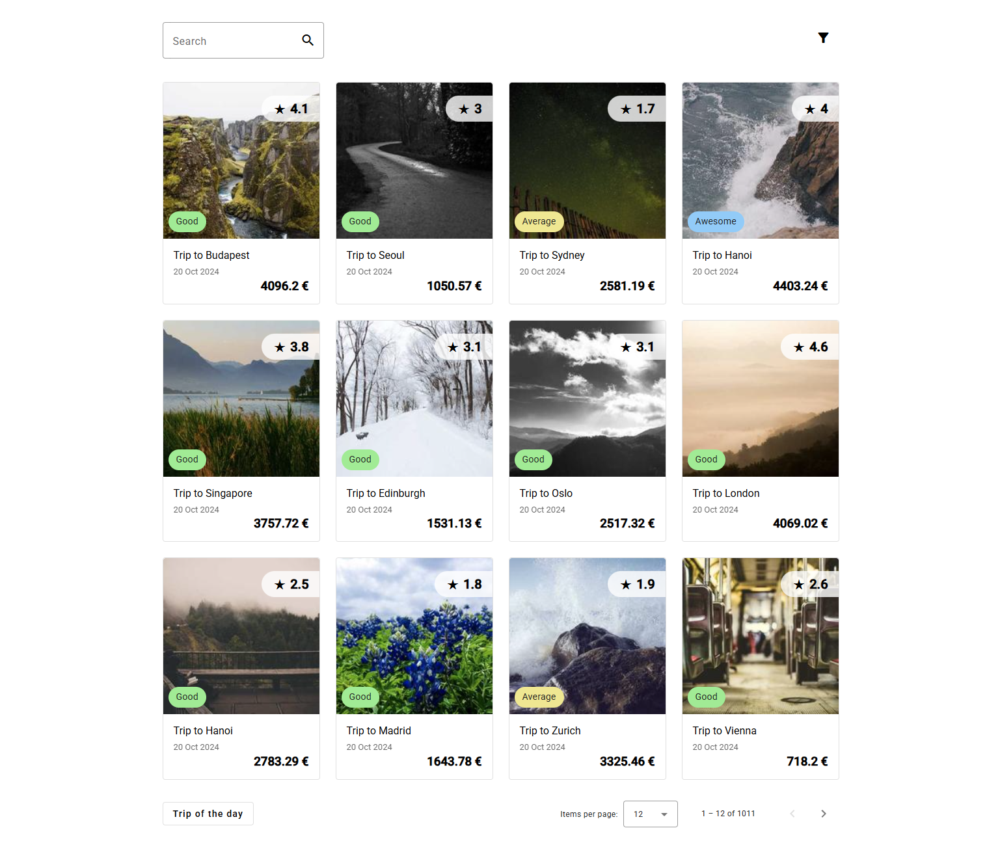

<!--
*** Amazing README template from othneildrew
*** https://github.com/othneildrew/Best-README-Template
-->


<!-- PROJECT LOGO -->
<br />
<div align="center">
  <h1>App Trips</h1>
  
</div>

<!-- ABOUT THE PROJECT -->
## ℹ️ About The Project

Take-home challenge from BizAway.

The objective is to create a simple travel platform, which will allow the user to interact with a list of travels fetched from an API.
Travels from the list can be opened on a new page to see a more detailed view.
The list has to be filterable and has to keep its state when navigating to other pages and going back.
A trip of the day feature has to be implemented where a random travel is shown, the travel musn't change during the duration of the day.

Unit tests had to be developed for the app.

### Subject

* [Subject](https://bitbucket.org/bizaway/tech-challenge/src/main/frontend.md)

### Built With

* [Angular](https://angular.io/)
* [AngularMaterial](https://material.angular.io/)

<p align="right">(<a href="#top">back to top</a>)</p>


<!-- GETTING STARTED -->
## 🏃 Quick Start

This project was generated with [Angular CLI](https://github.com/angular/angular-cli) version 18.1.3.

### Prerequisites

* Have [NodeJs](https://www.docker.com/) (at minimum v18.13) installed

### Installation

* Clone the repo
```sh
  git clone https://github.com/its-a-maxi/app-trips.git
```
  
<p align="right">(<a href="#top">back to top</a>)</p>


<!-- USAGE EXAMPLES -->
## ⌨️ Usage

* Start the app locally
```sh
  npm run start
```

* Navigate to [localhost:4200](http://localhost:4200/)
  
<br />
<br />

* For running the unit tests (with karma)
```sh
  npm run test
```

* For building the app
```sh
  npm run build
```

<p align="right">(<a href="#top">back to top</a>)</p>


<!-- CONTACT -->
## 📫 Contact

Maximo Monroy - monroy.vds@gmail.com

Project Link: [https://github.com/its-a-maxi/app-trips](https://github.com/its-a-maxi/app-trips)

<p align="right">(<a href="#top">back to top</a>)</p>

